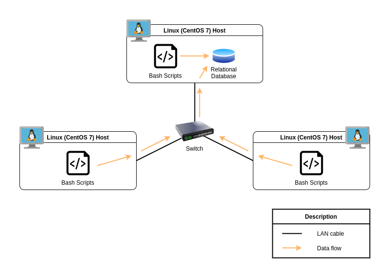

# Linux Cluster Monitoring Agent
This project is under development. Since this project follows the GitFlow, the final work will be merged to the main branch after Team Code Team.

## Introduction
The Jarvis Linux Cluster Administration (LCA) team manages a Linux cluster of 10 nodes/servers running CentOS 7. These servers are internally connected through a switch and able to communicate through internal IPv4 addresses.

The LCA team needs to record the hardware specifications of each node and monitor node resource usage (e.g. CPU, memory) in real-time and stored in an RDBMS.

The LCA team will use the data to generate reports for future resource planning purposes (e.g. add or remove servers).

## Quick Start
### Command to create / start / stop PostgreSQL container

`$ ./scripts/psql_docker.sh start|stop|create [db_username][db_password]`

```
// To create and start PostgreSQL container
$ ./scripts/psql_docker.sh create <db_username> <db_password>

// To start PostgreSQL container
$ ./scripts/psql_docker.sh start

// To stop PostgreSQL container
$ ./scripts/psql_docker.sh stop
```

### Before any connect to the psql instance
```
$ export PGPASSWORD=<db_password>
```

### Command to connect to the psql instance
```
// connect to the psql instance
$ psql -h localhost -U <db_username> -W
```

### Command to Data Definition Language (DDL)
```
$ psql -h localhost -U postgres -d host_agent -f sql/ddl.sql
```


## Implemenation

### Architecture


### Scripts


### Database Modeling

## Test

## Deployment

## Improvements